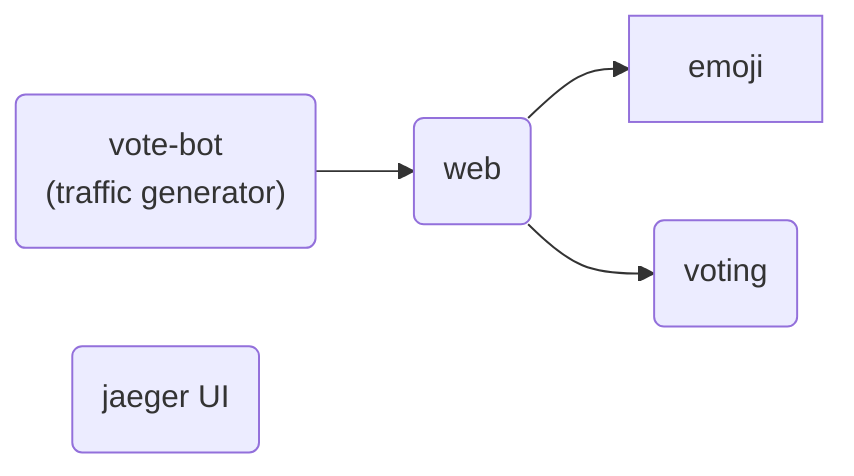

# Getting Started with Go OpenTelemetry Automatic Instrumentation

In this tutorial, we will walk through how to get started with instrumenting the [emojivoto](https://github.com/BuoyantIO/emojivoto) application, a well known microservice example running locally on a Kubernetes cluster.

## Before you begin

The following tools are required to run this tutorial:

- [Kind](https://kind.sigs.k8s.io/) to run a local Kubernetes cluster with Docker container nodes.
- [Kubernetes CLI (kubectl)](https://kubernetes.io/docs/tasks/tools/install-kubectl/) to run commands against Kubernetes clusters.

## Creating the Kubernetes cluster

Create a new local Kubernetes cluster, by running the following command:

```shell
kind create cluster
```

## Deploying tha target applications

The Kubernetes cluster will run the emojivoto applications and a jaeger UI for visualizing the OpenTelemetry traces:


